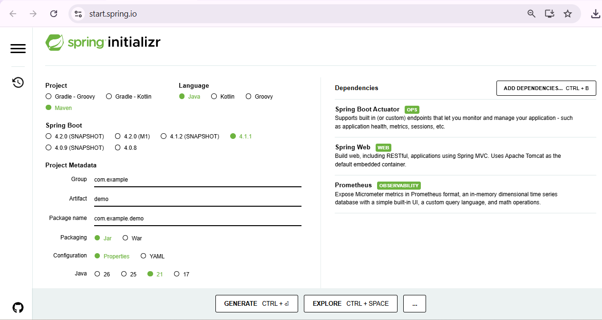
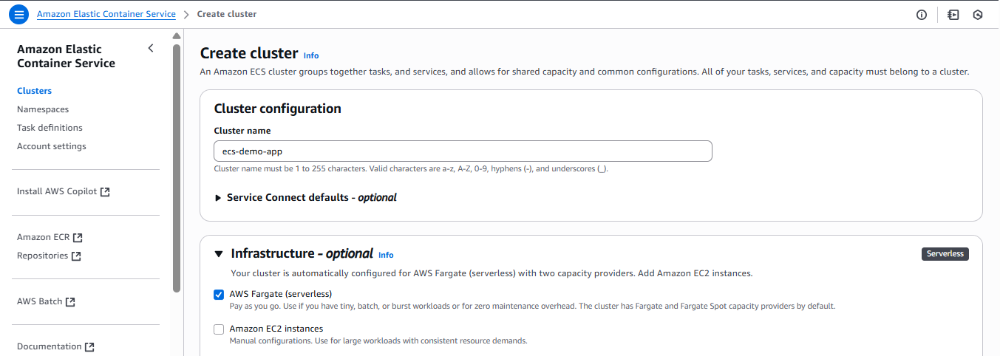

# SprintBot web app

### Spring initializr 

1. Open https://start.spring.io/
2. Add actuator and spring web dependecy and selects option as below 


### Run on local

```bash
mvn clean install
java -jar target/demo-0.0.1-SNAPSHOT.jar --server.port=8081
```

Check the app locally:

```bash
http://localhost:8081/
http://localhost:8081/actuator
http://localhost:8081/actuator/prometheus
```

### Dockerfile Setup
Create Dockerfile

### Github Workflows
1. Create .github/workflows/ci.yml file
2. Replace <your-dockerhub-username> with your dockerhub username
3. Add below secrets in github

    DOCKER_USERNAME: Your Docker Hub username
    DOCKER_PASSWORD: Your Docker Hub password or personal access token


### Run with Docker
```
docker run -it -d --name sprintboot -p 8080:80 <your-dockerhub-username>/spring-boot-app:latest
```

### Run on K8S
1. Replace <your-dockerhub-username> with your dockerhub username

```
kubectl apply -f eks/ -n testns
```


### Run on ECS 
1. Login aws console and select ECS
2. Click on Create Cluster
3. Provide cluster name and select AWS Fargate 



#### Create new task defination
1. image url: <your-dockerhub-username>/spring-boot-app:latest
2. container port: 8080 (spring boot default port)
3. host port : 80 (port name)


#### Create new service

Create new Service

By default, ecs load balancer not accessble from internet so modify the Loadbalancer inbound rule to open trafic form internet.


